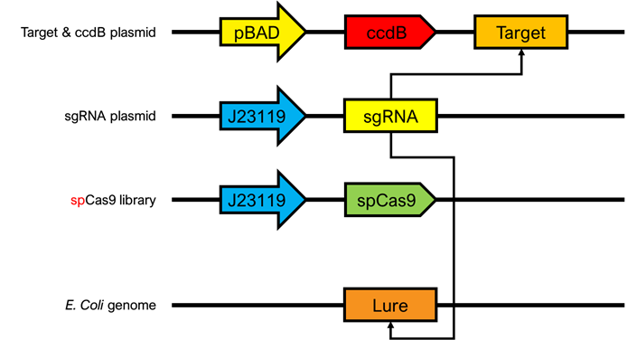
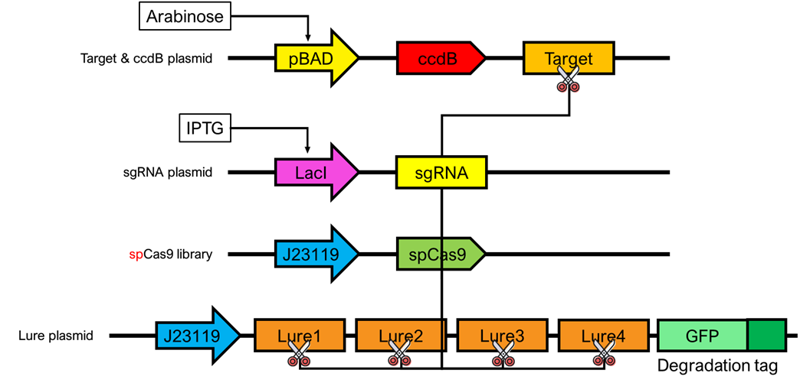

# DECas9

## Notes

| New Ideas                                                    |
| ------------------------------------------------------------ |
| xCas9的启发：突变Cas9蛋白的同时，对比多种不同PAM序列，结合PAM序列选择性的理性设计，得到最好的DECas9-xsgRNA搭配。（此处xsgRNA指代变换PAM序列后的sgRNA） |
| 通过不同的Cas9突变探索了Cas9蛋白的序列空间，结合对应基因切割的活性（脱靶率），借助神经网络的方法对Cas9蛋白进行Rational design。并结合Rational Design优化DE方法 |

| To-do list                                                |
| --------------------------------------------------------- |
| Read xCas9 paper                                          |
| Read DE method review                                     |
| Recruit group members                                     |
| Fulfill experiment designs (method and experiment design) |
| Reading: Machine learning process in directed evolution   |

## Background

### Directed Evolution

[定向进化 Directed Evolution](https://en.wikipedia.org/wiki/Directed_evolution)

**Directed evolution** (**DE**) is a method used in [protein engineering](https://en.wikipedia.org/wiki/Protein_engineering) that mimics the process of [natural selection](https://en.wikipedia.org/wiki/Natural_selection) to steer [proteins](https://en.wikipedia.org/wiki/Proteins) or [nucleic acids](https://en.wikipedia.org/wiki/Nucleic_acid) toward a user-defined goal.

It consists of subjecting a [gene](https://en.wikipedia.org/wiki/Gene) to iterative rounds of [**mutagenesis**](https://en.wikipedia.org/wiki/Mutagenesis) (creating a library of variants), **selection** (expressing those variants and isolating members with the desired function) and **amplification** (generating a template for the next round). It can be performed *[in vivo](https://en.wikipedia.org/wiki/In_vivo)* (in living organisms), or *[in vitro](https://en.wikipedia.org/wiki/In_vitro)* (in cells or free in solution). 

### Off-Target in CRISPR-Cas9

## Motivation

### xCas9

[xCas9](https://www.nature.com/articles/nature26155)

### evoCas9

[evoCas9](https://www.nature.com/articles/nbt.4066)

### sniperCas9

[sniperCas9](https://www.nature.com/articles/s41467-018-05477-x)

## Design

中心思想：利用定向进化的方法对特定CRISPR切割位点及其脱靶潜在位点进行优化，使其脱靶率大大降低。

展开：

- 传统方式：突变Cas9蛋白，使得到的DECas9蛋白能够在结合正常sgRNA的条件下有尽量低的脱靶效率和较高的中靶效率。
- xCas9的启发：突变Cas9蛋白的同时，对比多种不同PAM序列，结合PAM序列选择性的理性设计，得到最好的DECas9-xsgRNA搭配。（此处xsgRNA指代变换PAM序列后的sgRNA）
- 通过不同的Cas9突变探索了Cas9蛋白的序列空间，结合对应基因切割的活性（脱靶率），借助神经网络的方法对Cas9蛋白进行Rational design。并结合Rational Design优化DE方法

### Design1: sniperCas9 replica

### Design2: GFP reporter

### Design3: Multiple lure

## Experiments

### Target gene

Target gene: CCR5, More?

[Inhibition of HIV-1 infection of primary CD4+ T-cells by gene editing of CCR5 using adenovirus-delivered CRISPR/Cas9](https://doi.org/10.1099/vir.0.000139)

### Mutagenesis

#### Error-prone PCR 

Achieved by changing solution environment and using low-fidelity polymerase.

[Protocol: Random Mutagenesis by Error-Prone PCR](https://link.springer.com/protocol/10.1007%2F978-1-60761-652-8_7)

### Amplification

#### DNA shuffling-repeat

Achieved by many different ways including **sexual PCR** (有性PCR) and **stagger extension process**

sexual PCR的protocol和stagger extension process的protocol待整理

### Measurements

如何实现对脱靶程度的检测？

## Model

### Off-target prediction model

参考2019年项目

[Single mismatch](https://2019.igem.org/Team:SJTU-BioX-Shanghai/Model/Single_Mismatch)

### Machine learning guided DE

[Machine-learning-guided directed evolution for protein engineering](https://www.nature.com/articles/s41592-019-0496-6)